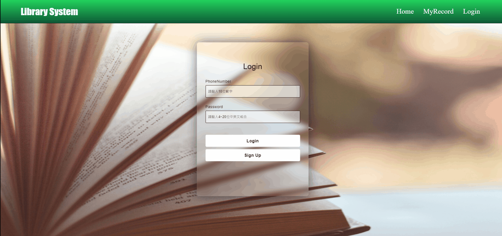
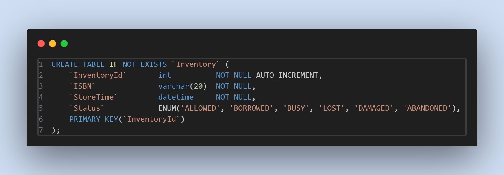
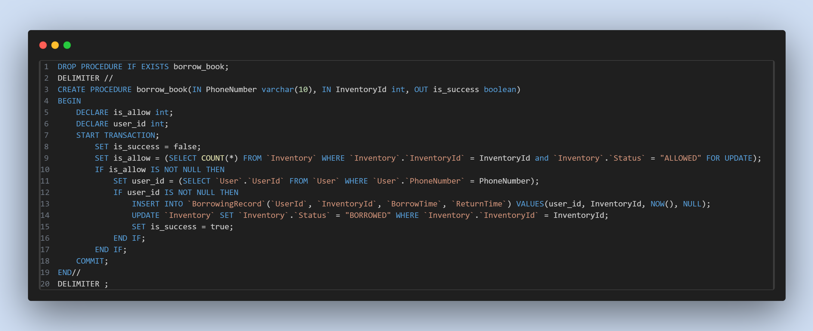

=== [.red]#DEMO#

* * *

* 登入

* * *

* 登出

* * *

* 註冊

* * *

* 借書

* * *

* 還書

* * *

* 評論

image::imgs/gif/review.gif[, 90%, 80%, align=center]

* * *

* 尚未登入

[, 90%, 80%, align=center]

* * *

* 登入過期

[, 90%, 80%, align=center]

=== [.red]#Pre-requisites#
* * *

* Java 17+
* npm and node
* Docker

=== [.red]#直接執行不進行編譯#

[,bash]
----
 $ docker compose -f ./docker-compose2.yaml up
----

在每次上傳檔案後，會使用 GitHub Action 來上傳 images。因此可以直接用上面指令啟動伺服器。

=== [.red]#編譯 WEB 和 APPLICATION 並執行#
* * *

編譯 WEB 端 

[,bash]
----
 $ cd ./frontend; npm install; npm run build
----

編譯 APP 端 

[,bash]
----
 $ cd ./backend; ./gradlew build
----

啟動 SERVER  

[,bash]
----
 $ docker compose up 
----

進入 http://localhost:8080/

=== [.red]#架構圖#
* * *

若使用 docker compose 開啟，架構如上圖所示，利用 NGINX 做為 WEB 伺服器，代理靜態文件伺服器，也作為負載平衡器，將流量分配到兩個伺服器上。資料庫方面，由兩個 APP 共同使用，且會自動載入測試資料。

=== [.red]#WEB 端#
* * *

在 WEB 端方面，首先會將寫好的 VUE 檔案做編譯，放入 NGINX 資料夾中，利用上面的 CODE 代理靜態檔案。在執行測試時，在頁面轉換上有遇到 404 PAGE NOT FOUND 的問題，上網查了資料，原來因為我使用的 VUE-ROUTER 模式是 HTML5 MODE，官網資料是說，若用戶直接在瀏覽器下訪問路徑，BROWSER 會直接訪問 WEB 端，而 WEB 端會找不到資料就會回傳 404 ERROR。為解決這問題，透過最後一行的try_files，如果 URL 與任何靜態資源都不匹配，就會返回 index.html 頁面，從而解決這問題。

* * *

在負載平衡器方面，利用上述代碼，會將流量分配到兩台伺服器上，在沒有設定情形下，使用 NGINX 預設方法 round-robin，若第一個請求分配到 serverA、第二個則會分配到 serverB、
第三個則會分配到 serverA...，以此類推下去。

=== [.red]#APP 端#
* * *
image::imgs/code-snapshotC.png[, 90%, 80%, align=center]
在 password 存儲方面，使用 Spring Security 中的 BCryptPasswordEncoder 對資料做雜湊，並使用 SecureRandom 方法，每次都會生成不同的 salt 值，所以相同的密碼並不會產生相同的雜湊值。

image::imgs/code-snapshotD.png[, 90%, 80%, align=center]
當使用者傳入 rawPassword 時，會和資料庫中經過雜湊的密碼做比較，來檢驗使用者身分。

* * *

image::imgs/code-snapshotE.png[, 90%, 80%, align=center]

為了建立 RESTful 伺服器，使用 JWT Token 作為使用者授權機制。當使用者登入成功時，會派發給對方一個 Token，並且這個 Token 使用私鑰做加密保護。

當使用者要做借還書這種要檢驗身分動做時，會將 Token 放入 Authorization Header 並出請求，等 APP Server 收到請求後，會取出 Authorization Header 的值。

並利用公鑰作解密，來驗證其身分。

* * *

Token 的存放則是交由資料庫處理。

且在資料庫創建 is_jwt_expired PROCEDURE ，來判定使用者的 JwtToken 是否過期。

每當使用者做借還書時，會先檢測使用者的登入狀態是否過期。

[, 90%, 80%, align=center]

若過期，前端收到通知，就會提醒使用者從新登入。

* * *

image::imgs/code-snapshotH.png[, 90%, 80%, align=center]

為了避免 SQL-Injection 和 XSS 攻擊，對於使用者所傳資料，使用 REGEX 做檢查。

並且做參數化查詢，這樣使用者輸入的參數有不當的指令也不會因此執行成功。

且使用 VUE 框架下，不論是用模板還是渲染函數，內容都會做轉義動作。

=== [.red]#資料庫#

* * *

image::imgs/code-snapshotJ.png[, 90%, 80%, align=center]

為了避面同時有多人註冊，會有 Phone Number 出現重複的問題，這裡將 Phone Number 設置為 UNIQUE ，這樣當第二個使用相同 Phone Number 註冊時，會插入失敗。在操作方面，由於會需要大量用 PhoneNumber 查詢 UserId ，因此對 PhoneNumber 建立 INDEX。

* * *

將 Inventory 中的 Status 設為 ENUM，避免書本會出現其他狀態。

* * *

image::imgs/code-snapshotM.png[, 90%, 80%, align=center]

對於可能多人同時借還書動作發生時，利用 Row Lock，使得一次只能有一個人對一本書做借還書。

* * *

[cols="1,1"]
|===

|使用者1借書本4
|使用者2借書本4

|TRANSACTION 1
|

|
|TRANSACTION 2

|查詢書本4的狀態 +
SET is_allow = (SELECT COUNT(\*) FROM \`Inventory` WHERE \`Inventory`.\`InventoryId` = 4 and \`Inventory`.\`Status` = "ALLOWED" FOR UPDATE); + 
|

|
|查詢書本4的狀態 +
SET is_allow = (SELECT COUNT(\*) FROM \`Inventory` WHERE \`Inventory`.\`InventoryId` = 4 and \`Inventory`.\`Status` = "ALLOWED" FOR UPDATE); + 
`__阻塞__`

|書本狀態是 "ALLOWED" 且 user_id 是存在 +
對 BorrowingRecord 插入新紀錄，且更新 Inventory 中的狀態為 BORROWED +
INSERT INTO \`BorrowingRecord`(\`UserId`, \`InventoryId`, \`BorrowTime`, \`ReturnTime`) VALUES(user_id, InventoryId, NOW(), NULL); +
UPDATE \`Inventory` SET \`Inventory`.\`Status` = "BORROWED" WHERE \`Inventory`.\`InventoryId` = InventoryId;
| `__阻塞__`

| COMMIT;
| `__阻塞__`

|
|is_allow 是 NULL，代表書本狀態不為 ALLOWED 所以 IF THEN ... END 並不會執行。

|
| COMMIT;

|=== 

借書時，會將 Inventory table 中要更新的 row 做 lock ，並確認其狀態是否為 ALLOWED ，若其狀態為 ALLOWED ，接著檢查使用者 ID 是否存在，接著就會對 Inventory 和 BorrowingRecord table 做更新和插入。後面要借書的人會因為 *IF is_allow = "ALLOWED" THEN* 這行被擋下來。 

* * *

image::imgs/code-snapshotO.png[, 90%, 80%, align=center]

還書時，會將 Inventory table 中要更新的 row 做 lock ，並確認其狀態是否為 BORROWED ，若其狀態為 BORROWED，接著檢查使用者 ID 是否存在，再檢查此使用者在 BorrowingRecord 中是否有借書紀錄，接著就對 BorrowingRecord 和 Inventtory 做更新。

[cols="1,1,1"]
|=== 

|使用者1還書本4
|使用者2借書本4
|使用者1還書本4

|TRANSACTION 1
|
|

|
|
|TRANSACTION 3

|查詢書本4的狀態 +
SET is_borrow = (SELECT COUNT(*) FROM \`Inventory` WHERE \`Inventory`.\`InventoryId` = 4 and \`Inventory`.\`Status` = "BORROWED");
|
|

|
|
|查詢書本4的狀態 +
SET is_borrow = (SELECT COUNT(*) FROM \`Inventory` WHERE \`Inventory`.\`InventoryId` = 4 and \`Inventory`.\`Status` = "BORROWED");

|書本4的狀態為 BORROWED，查詢使用者 ID +
SET user_id = (SELECT \`User`.\`UserId` FROM \`User` WHERE \`User`.\`PhoneNumber` = PhoneNumber);
|
|

|
|
|書本4的狀態為 BORROWED，查詢使用者 ID +
SET user_id = (SELECT \`User`.\`UserId` FROM \`User` WHERE \`User`.\`PhoneNumber` = PhoneNumber);

|使用者存在，查詢是否有書本4借書紀錄 +
SET is_borrowed_by_user = (SELECT COUNT(*) FROM \`BorrowingRecord` WHERE \`BorrowingRecord`.\`UserId` = user_id and \`BorrowingRecord`.\`InventoryId` = 4 and \`BorrowingRecord`.\`ReturnTime` = NULL);
|
|

|
|
|使用者存在，查詢是否有書本4借書紀錄 +
SET is_borrowed_by_user = (SELECT COUNT(*) FROM \`BorrowingRecord` WHERE \`BorrowingRecord`.\`UserId` = user_id and \`BorrowingRecord`.\`InventoryId` = 4 and \`BorrowingRecord`.\`ReturnTime` = NULL);

|有借書紀錄，更新 BorrowingRecord 和 Inventory table +
UPDATE \`BorrowingRecord` SET \`BorrowingRecord`.\`ReturnTime` = NOW() WHERE \`BorrowingRecord`.\`InventoryId` = 4 and \`BorrowingRecord`.\`UserId` = ser_id; +
UPDATE \`Inventory` SET \`Inventory`.\`Status` = "ALLOWED" WHERE \`Inventory`.\`InventoryId` = 4;
|
|

|COMMIT;
|
|

|
|TRANSACTION 2
|

|
|使用者2執行借書操作，並成功 COMMIT;
|

|
|
|有借書紀錄，更新 BorrowingRecord 和 Inventory table +
UPDATE \`BorrowingRecord` SET \`BorrowingRecord`.\`ReturnTime` = NOW() WHERE \`BorrowingRecord`.\`InventoryId` = 4 and \`BorrowingRecord`.\`UserId` = ser_id; +
UPDATE \`Inventory` SET \`Inventory`.\`Status` = "ALLOWED" WHERE \`Inventory`.\`InventoryId` = 4; +
`__ERROR__`

|=== 

在執行還書操作，會將 Inventory table 中要更新的 row 做 lock，是為了避免上面的狀況發生。若使用者因操作 API 問題，執行兩次還書操作，這中間又有人借同本書。就可能發生上面狀況，使得使用者2成功借到書本4，但書本4的狀態卻是 ALLOWED 的問題。
 
