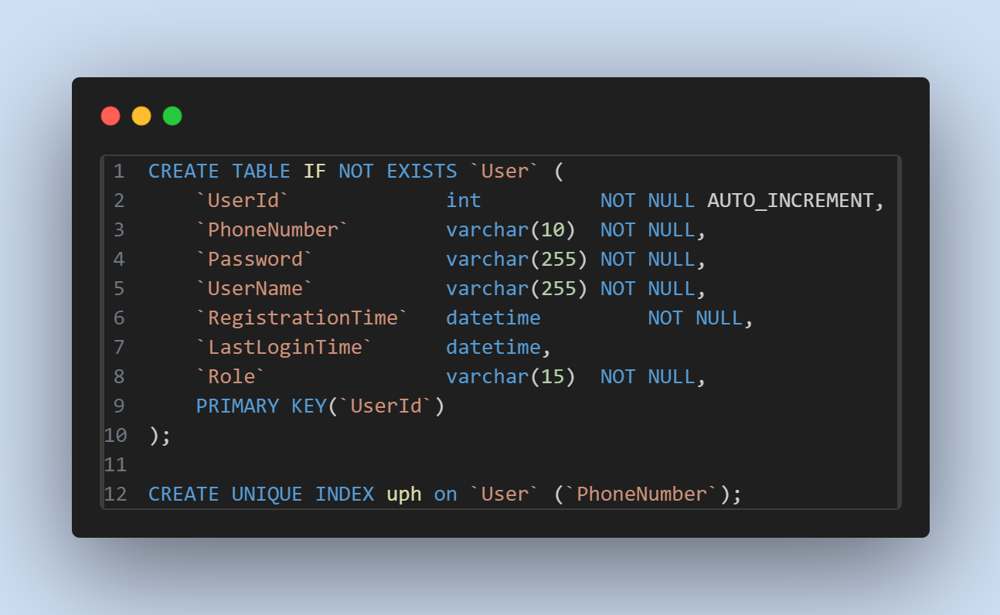

=== [.red]#Pre-requisites#

* Java 17+
* npm and node
* Docker

=== [.red]#編譯 WEB 和 APPLICATION 並執行#

編譯 WEB 端 

[source]
----
cd ./frontend; npm install; npm run build
----

編譯 APP 端 

[source]
----
cd ./backend; ./gradlew build
----

啟動 SERVER  

[source]
----
docker compose up
----

=== [.red]#架構圖#
image::imgs/arch.png[]

若使用 docker compose 開啟，架構如上圖所示，利用 NGINX 做為 WEB 伺服器，作為靜態文件伺服器，並也作為負載平衡器，將流量分配到兩個伺服器上。資料庫方面，由兩個 APP 共同使用，且會自動載入測試資料。

=== [.red]#WEB 端#
image::imgs/code-snapshotA.png[]
在 WEB 端方面，首先會將寫好的 VUE 檔案做編譯，放入 NGINX 資料夾中，利用上面的 CODE 代理靜態檔案。在執行測試時，在頁面轉換上有遇到 404 PAGE NOT FOUND 的問題，上網查了資料，原來因為我使用的 VUE-ROUTER 模式是 HTML5 MODE，官網資料是說，若用戶直接在瀏覽器下訪問路徑，BROWSER 會直接訪問 WEB 端，而 WEB 端會找不到資料就會回傳 404 ERROR。為了解決這問題，透過最後在最後一行try_files，如果 URL 與任何靜態資源都不匹配，就會返回 index.html 頁面，從而解決這問題。

* * *

image::imgs/code-snapshotB.png[]
在負載平衡器方面，利用上述代碼，會將流量分配到兩台伺服器上，在沒有設定情形下，使用 NGINX 預設方法 round-robin，若第一個請求分配到 serverA、第二個則會分配到 serverB、
第二個則會分配到 serverA...，以此類推下去。

=== [.red]#APP 端#

在 password 存儲方面，使用 Spring Security 中的 BCryptPasswordEncoder 對資料做雜湊，並使用 SecureRandom 方法，每次都會生成不同的 salt 值，所以相同的密碼並不會產生相同的雜湊值。

當使用者傳入 rawPassword 時，會和資料庫中經過雜湊的密碼做比較，來檢驗使用者身分。

* * *

為了建立 RESTful 伺服器，使用 JWT Token 作為使用者授權機制。當使用者登入成功時，會派發給對方一個 Token，並且這個 Token 使用公鑰做加密保護。

image::imgs/code-snapshotF.png[]

當使用者要做借還書這種要檢驗身分動做時，會將 Token 放入 Authorization Header 並出請求，等 APP Server 收到請求後，會取出 Authorization Header 的值。

image::imgs/code-snapshotG.png[]

並利用私鑰作解密，來驗證其身分。

image::imgs/code-snapshotI.png[]

Token 的存放則是交由資料庫處理。

* * *

為了避免 SQL-Injection 和 XSS 攻擊，對於使用者所傳資料，使用 REGEX 做檢查。

=== [.red]#資料庫#

為了避面同時有多人註冊，會有 Phone Number 出現重複的問題，這裡將 Phone Number 設置為 UNIQUE ，這樣當地二個使用相同 Phone Number 註冊時，會插入失敗。

* * *

image::imgs/code-snapshotK.png[]

將 Inventory 中的 Status 設為 ENUM，避免書本會出現其他狀態。

* * *

對於要同時查詢多個資料表的動作時，使用 Transaction 來避免 Read uncommited 的問題發生。

* * *

對於可能多人同時借還書動作發生時，利用 Row Lock，來避免可能資料更新遺失的情況出現。

=== [.red]#DEMO#

image::imgs/login.gif[]
登入

* * *

image::imgs/logout.gif[]
登出

* * *

image::imgs/signUp.gif[]
註冊

* * *

image::imgs/borrowBook.gif[]
借書

* * *

image::imgs/returnBook.gif[]
還書
